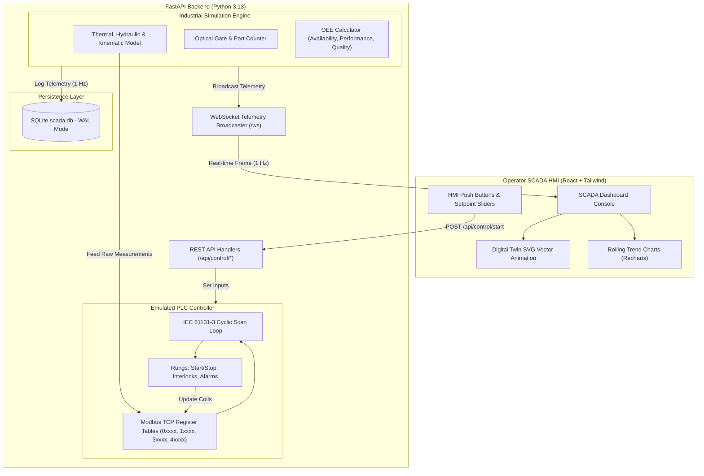
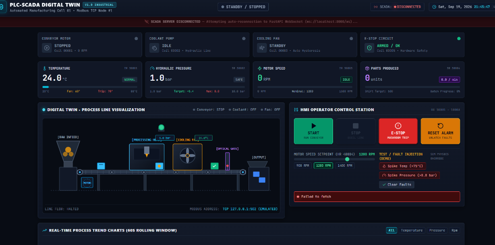

# 🏭 PLC-SCADA Digital Twin Dashboard


A production-grade, local-first industrial automation simulation platform that emulates an automated manufacturing line, **IEC 61131-3 PLC ladder logic**, **Modbus TCP memory mapping**, **real-time SCADA HMI monitoring**, **interactive vector digital twin animations**, **safety interlocks**, and **Overall Equipment Effectiveness (OEE)** analytics—**without requiring any physical PLC or proprietary hardware**.

---

## 📋 Table of Contents
- [1. Project Overview](#1-project-overview)
- [2. Problem Statement](#2-problem-statement)
- [3. Objectives](#3-objectives)
- [4. Key Features](#4-key-features)
- [5. System Architecture](#5-system-architecture)
- [6. Technology Stack](#6-technology-stack)
- [7. PLC Control Logic & Safety Interlocks](#7-plc-control-logic--safety-interlocks)
- [8. SCADA HMI Functionality](#8-scada-hmi-functionality)
- [9. Digital Twin Process Simulation](#9-digital-twin-process-simulation)
- [10. Modbus TCP Register Map](#10-modbus-tcp-register-map)
- [11. Database Design (SQLite WAL)](#11-database-design-sqlite-wal)
- [12. REST & WebSocket API Documentation](#12-rest--websocket-api-documentation)
- [13. Installation & Setup (Windows)](#13-installation--setup-windows)
- [14. How to Run Backend & Frontend](#14-how-to-run-backend--frontend)
- [15. Verification & Testing](#15-verification--testing)
- [16. Screenshots & Visual Interface](#16-screenshots--visual-interface)
- [17. OEE Calculation Formula](#17-oee-calculation-formula)
- [18. Future Scope & Extensions](#18-future-scope--extensions)
- [19. Learning Outcomes](#19-learning-outcomes)
- [20. Resume & Interview Bullet Points](#20-resume--interview-bullet-points)
- [21. Git & GitHub Publishing Guide](#21-git--github-publishing-guide)

---

## 1. Project Overview

In traditional automation engineering education, students face severe hardware barriers: industrial PLCs (Siemens S7, Allen-Bradley ControlLogix), SCADA licenses (Ignition, WinCC), and physical test benches cost thousands of dollars and are accessible only inside university laboratories.

This project delivers a **100% software-based industrial digital twin system** that faithfully replicates an industrial manufacturing cell:
- **Physical Line**: Raw material hopper $\rightarrow$ motorized conveyor $\rightarrow$ machining station with coolant $\rightarrow$ cooling fan chamber $\rightarrow$ photoelectric part gate $\rightarrow$ finished goods bin.
- **Controller**: Cyclic PLC scan engine executing ladder logic, safety latches, and hysteresis loops.
- **Fieldbus**: Emulated Modbus TCP memory map (Coils, Discrete Inputs, Input Registers, Holding Registers).
- **SCADA Console**: Modern dark-theme supervisory interface streaming real-time data over WebSockets at 1 Hz.

---

## 2. Problem Statement

Aspiring Automation, Mechatronics, and Robotics engineers need practical experience with:
1. Writing deterministic safety interlocks (Emergency Stop, thermal overload, pressure trip).
2. Understanding industrial communications (Modbus TCP address tables, function codes).
3. Architecting SCADA operator HMIs with alarm latching and acknowledgment workflows.
4. Tracking manufacturing performance metrics (OEE, availability, cycle times).

Without physical factory machinery, demonstrating these skills to recruiters is challenging. This project solves that gap with a realistic, runnable simulation.

---

## 3. Objectives

- **Emulate IEC 61131-3 PLC Execution**: Implement cyclic scan routines (`Input Scan` $\rightarrow$ `Logic Execution` $\rightarrow$ `Output Write`).
- **Simulate Continuous Physics**: Motor acceleration ramps, thermal load generation, forced-air cooling fan dissipation, and hydraulic pressure dynamics.
- **Enforce Hardware-Grade Safety Interlocks**: Instantaneous emergency braking, thermal hysteresis protection, and safe-condition alarm reset gating.
- **Provide Real-Time Visualization**: Animated SVG digital twin showing workpiece progression, tool actuation, coolant spray, and fan rotation.
- **Compute Industrial KPIs**: Continuous real-time calculations of Availability, Performance, Quality, and OEE.

---

## 4. Key Features

- ⚡ **Zero Hardware Needed**: Completely runnable on any local Windows, macOS, or Linux machine.
- 🔄 **Real-Time WebSocket Pipeline**: 1 Hz telemetry push delivering sub-second response times without browser polling.
- 🛡️ **Fail-Safe Interlocks**: Emergency Stop latch de-energizes all field outputs; alarm reset rejected if temperature $\ge 70^\circ\text{C}$ or pressure $> 8.0\text{ bar}$.
- 📊 **Dynamic Trend Charts**: 60-second rolling charts for Temperature, Pressure, and RPM with safety thresholds.
- 🎛️ **Operator HMI Station**: Start, Stop, Emergency Stop mushroom pushbutton, Alarm Reset, and Motor Speed setpoints.
- 🧪 **Fault Injection Simulator**: On-demand buttons to spike temperature or pressure to demonstrate alarm trip and cooling fan recovery during interviews.
- 🗄️ **Modbus Memory Inspector**: Collapsible live data table displaying raw integers and hex representations for Coils, Discrete Inputs, and Registers.
- 💾 **SQLite WAL Telemetry Log**: High-throughput non-blocking historical logging of sensor history, alarms, machine events, and production KPIs.

---

## 5. System Architecture



---

## 6. Technology Stack

### Frontend
- **Framework**: React 18
- **Build Tool**: Vite 5
- **Styling**: Tailwind CSS 3.4 (Industrial dark theme, LED glows, scanlines)
- **Icons**: Lucide React
- **Charting**: Recharts (ResponsiveContainer, LineChart, ReferenceLines)
- **Networking**: Native WebSocket with automatic backoff reconnection

### Backend
- **Runtime**: Python 3.13
- **Framework**: FastAPI (high-concurrency ASGI)
- **Server**: Uvicorn
- **Validation**: Pydantic v2
- **Testing**: Pytest & HTTPX TestClient

### Database
- **Engine**: SQLite 3 with Write-Ahead Logging (`PRAGMA journal_mode=WAL;`)

---

## 7. PLC Control Logic & Safety Interlocks

### Cyclic Scan Model
1. **Input Scan**: Reads Discrete Inputs (`10001` - `10003`) and Input Registers (`30001` - `30002`).
2. **Ladder Evaluation**: Evaluates safety contacts, latching relays, and trip hysteresis.
3. **Output Scan**: Writes to Coils (`00001` - `00005`).

### Core Ladder Logic Rungs
1. **Master Start/Stop**:
   $$\text{Conveyor} = (\text{Start\_PB} \lor \text{Conveyor}) \land \neg\text{Stop\_PB} \land \neg\text{E\_Stop} \land \neg\text{High\_Pressure}$$
2. **Coolant Pump Interlock**: Pump energizes synchronously with conveyor.
3. **Thermal Hysteresis Loop**:
   - $\text{Temp} > 70.0^\circ\text{C} \implies \text{Cooling Fan} = \text{ON}, \text{Alarm} = \text{ON}$
   - $\text{Temp} < 60.0^\circ\text{C} \implies \text{Cooling Fan} = \text{OFF}$
4. **High Pressure Trip**:
   - $\text{Pressure} > 8.0\text{ bar} \implies \text{Critical Alarm} = \text{ON}, \text{Conveyor} = \text{OFF}$
5. **Emergency Stop (Hard Interlock)**:
   - Depressing mushroom contact immediately cuts Conveyor, Pump, and Fan power, dropping motor RPM to 0 instantly.
6. **Reset Permissive Check**:
   - Reset allowed **only** when $\text{E-Stop is released} \land \text{Temp} < 70.0^\circ\text{C} \land \text{Pressure} \le 8.0\text{ bar}$.

---

## 8. SCADA HMI Functionality

The web dashboard is styled as a professional industrial SCADA console:
- **Header**: System state beacon, real-time clock, shift indicator, and connection health badge.
- **Machine Cards**: Conveyor, Coolant Pump, Cooling Fan, and E-Stop status with coil IDs and LED indicators.
- **Sensor Dials**: Temperature, Pressure, Motor RPM, and Total Parts with safety zones.
- **Trend Charts**: Rolling 60-second window with warning/trip threshold reference lines.
- **Control Panel**: Industrial START, STOP, EMERGENCY STOP, and RESET pushbuttons.
- **Alarm Management**: Priority 1 & 2 active banners and historical table.
- **Modbus Inspector**: Live view of register memory addresses, values, and hex representations.

---

## 9. Digital Twin Process Simulation

The digital twin includes an interactive animated SVG visualization:
1. **Raw Material Hopper**: Gravity feed bin dispensing parts.
2. **Motorized Conveyor**: Roller pulleys and translated belt track moving when conveyor is ON.
3. **Machining Station**: Dynamic toolhead and coolant mist spray activated when pump is running.
4. **Cooling Chamber**: Animated rotating fan blades that spin dynamically when thermal interlock triggers.
5. **Optical Inspection Laser**: Photoelectric beam that pulses green when a workpiece passes.
6. **Workpieces**: Three physical parts moving across stations in real-time.
7. **Alarm Strobe**: Flashing beacon on top of the cell during fault conditions.

---

## 10. Modbus TCP Register Map

| Modbus Address | Type | Data Type | Tag Name | Range / Unit | Description |
| :--- | :--- | :--- | :--- | :--- | :--- |
| `00001` | Coil | BOOL | `COIL_CONVEYOR_RUN` | 0 / 1 | Conveyor motor contactor |
| `00002` | Coil | BOOL | `COIL_PUMP_RUN` | 0 / 1 | Coolant circulation pump |
| `00003` | Coil | BOOL | `COIL_FAN_RUN` | 0 / 1 | Cooling exhaust fan |
| `00004` | Coil | BOOL | `COIL_ALARM_BEACON`| 0 / 1 | Master alarm horn / strobe |
| `00005` | Coil | BOOL | `COIL_ESTOP_ACTIVE` | 0 / 1 | Emergency stop safety flag |
| `10001` | Discrete In | BOOL | `DI_START_PB` | 0 / 1 | Green Start pushbutton |
| `10002` | Discrete In | BOOL | `DI_STOP_PB` | 0 / 1 | Red Stop pushbutton |
| `10003` | Discrete In | BOOL | `DI_ESTOP_PB` | 0 / 1 | E-Stop mushroom contact |
| `10004` | Discrete In | BOOL | `DI_OPTICAL_GATE` | 0 / 1 | Photoelectric part sensor |
| `30001` | Input Reg | INT16 | `IR_TEMPERATURE` | $0.1^\circ\text{C}$ (e.g. 245 = $24.5^\circ\text{C}$) | RTD temperature sensor |
| `30002` | Input Reg | INT16 | `IR_PRESSURE` | 0.1 bar (e.g. 52 = 5.2 bar) | Pressure transducer |
| `30003` | Input Reg | INT16 | `IR_MOTOR_RPM` | 0 - 1500 RPM | Tachometer encoder |
| `30004` | Input Reg | INT16 | `IR_PART_COUNTER` | 0 - 1000 units | Total completed parts |
| `30005` | Input Reg | INT16 | `IR_MACHINE_STATE`| 0=STOP, 1=RUN, 2=FLT, 3=ESTOP | Overall state code |
| `40001` | Holding Reg | INT16 | `HR_TEMP_LIMIT` | Default: 700 ($70.0^\circ\text{C}$) | Over-temp trip point |
| `40002` | Holding Reg | INT16 | `HR_FAN_OFF_LIMIT`| Default: 600 ($60.0^\circ\text{C}$) | Fan shutoff point |
| `40003` | Holding Reg | INT16 | `HR_PRESSURE_LIMIT`| Default: 80 (8.0 bar) | High-pressure trip point |
| `40004` | Holding Reg | INT16 | `HR_SPEED_SETPOINT`| Default: 1200 RPM | Motor reference speed |

---

## 11. Database Design (SQLite WAL)

- `sensor_history`: `(id, timestamp, temperature, pressure, motor_rpm, fan_state, pump_state, conveyor_state)`
- `alarms`: `(id, timestamp, resolved_at, alarm_type, severity, message, status)`
- `machine_events`: `(id, timestamp, event_type, details)`
- `production`: `(id, timestamp, part_count, run_time_seconds, down_time_seconds, availability, performance, quality, oee)`

---

## 12. REST & WebSocket API Documentation

### REST API (`http://localhost:8000`)
- `GET /api/status`: System status and actuator coil states.
- `GET /api/sensors`: Real-time sensor readings.
- `GET /api/alarms?active_only=false`: Historical and active alarms.
- `GET /api/production`: Production counts and OEE breakdown.
- `GET /api/history?limit=60`: Rolling sensor log for charts.
- `GET /api/modbus/registers`: Full dump of all Modbus tables.
- `POST /api/control/start`: Issues start command.
- `POST /api/control/stop`: Issues stop command.
- `POST /api/control/emergency-stop`: `{"activate": true|false}`.
- `POST /api/control/reset-alarm`: Resets latched alarms (validates safety permissive).
- `POST /api/control/set-speed`: `{"speed_rpm": 1200}`.
- `POST /api/simulation/fault`: `{"fault_type": "temperature"|"pressure", "value": 78.0}`.
- `POST /api/simulation/clear-faults`: Restores normal simulation physics.

### WebSocket Feed (`ws://localhost:8000/ws`)
Broadcasts a full telemetry JSON frame every 1.0 second containing sensors, actuators, machine state, OEE, active alarms, and Modbus registers.

---

## 13. Installation & Setup (Windows)

### Prerequisites
- Python 3.10+ (Tested on Python 3.13)
- Node.js 18+ (Tested on Node v24)
- Git

### Step 1: Clone Repository
```powershell
git clone https://github.com/<your-username>/plc-scada-digital-twin.git
cd plc-scada-digital-twin
```

### Step 2: Set Up Backend Virtual Environment
```powershell
cd backend
python -m venv venv
venv\Scripts\activate
pip install -r requirements.txt
```

### Step 3: Install Frontend Dependencies
```powershell
cd ..\frontend
npm install
```

---

## 14. How to Run Backend & Frontend

### Terminal 1: Launch Backend Server
```powershell
cd backend
venv\Scripts\activate
python run.py
```
- **Backend API**: `http://localhost:8000`
- **Interactive Swagger Docs**: `http://localhost:8000/docs`
- **WebSocket Endpoint**: `ws://localhost:8000/ws`

### Terminal 2: Launch Frontend HMI Dashboard
```powershell
cd frontend
npm run dev
```
- **SCADA Web Dashboard**: `http://localhost:5173`

---

## 15. Verification & Testing

The backend includes automated tests covering PLC safety interlocks, thermal hysteresis, alarm reset gating, and OEE calculations:

```powershell
cd backend
venv\Scripts\activate
python -m pytest tests/ -v
```

### Expected Output
```text
tests/test_api.py::test_root_endpoint PASSED
tests/test_api.py::test_get_status_endpoint PASSED
tests/test_api.py::test_get_sensors_endpoint PASSED
tests/test_api.py::test_control_start_and_stop PASSED
tests/test_api.py::test_emergency_stop_api PASSED
tests/test_api.py::test_speed_setpoint_api PASSED
tests/test_api.py::test_modbus_register_dump PASSED
tests/test_plc_logic.py::test_start_logic PASSED
tests/test_plc_logic.py::test_stop_logic PASSED
tests/test_plc_logic.py::test_emergency_stop_trip_and_lockout PASSED
tests/test_plc_logic.py::test_high_temperature_fan_and_alarm_hysteresis PASSED
tests/test_plc_logic.py::test_high_pressure_alarm PASSED
tests/test_plc_logic.py::test_alarm_reset_conditions PASSED
tests/test_plc_logic.py::test_production_counter_and_runtime PASSED
======================= 14 passed in 1.40s =======================
```

---

## 16. Screenshots & Visual Interface

### 1. Main SCADA Console & Digital Twin

*Full dark-theme supervisory dashboard featuring real-time sensor dials, animated digital twin line, control buttons, and trend graphs.*

### 2. High-Temperature Alarm & Cooling Fan Auto-Recovery

*Demonstration of thermal interlock: temperature exceeds 70°C, triggering forced-air cooling fan and flashing alarm beacon.*

---

## 17. OEE Calculation Formula

Overall Equipment Effectiveness (OEE) is calculated according to standard industrial manufacturing formulas:

$$\text{OEE} = \text{Availability} \times \text{Performance} \times \text{Quality}$$

1. **Availability**:
   $$\text{Availability} = \frac{\text{Operating Time}}{\text{Total Planned Time}} \times 100\%$$
   *Measures uptime loss due to breakdowns, emergency stops, or manual halts.*

2. **Performance**:
   $$\text{Performance} = \frac{\text{Total Parts Produced}}{\text{Operating Time} / \text{Ideal Cycle Time}} \times 100\%$$
   *Measures speed losses when the conveyor runs below its nominal 1200 RPM rating.*

3. **Quality**:
   $$\text{Quality} = \frac{\text{Good Parts}}{\text{Total Parts Produced}} \times 100\%$$
   *Measures first-pass yield.*

- **World Class**: $\text{OEE} \ge 85\%$
- **Typical / Good**: $75\% \le \text{OEE} < 85\%$
- **Needs Attention**: $\text{OEE} < 65\%$

---

## 18. Future Scope & Extensions

- **Node-RED Flow Integration**: Connect an industrial dashboard or IoT gateway directly to the WebSocket feed.
- **OPC-UA Server Bridge**: Add an asynchronous Python `asyncua` server exposing Modbus nodes as OPC-UA variables.
- **MQTT Broker Integration**: Publish telemetry topics (`scada/line1/sensors`) to HiveMQ or Mosquitto.
- **Physical Arduino / ESP32 Hardware-in-the-Loop**: Connect an actual physical Emergency Stop button and potentiometer over serial or WiFi Modbus TCP.

---

## 19. Learning Outcomes

1. **Industrial Logic**: Mastered state machines and safety interlock design under IEC 61131-3.
2. **OT/IT Convergence**: Integrated industrial communication registers with high-speed WebSockets and asynchronous Python.
3. **Full-Stack SCADA**: Developed reactive HMI dashboards using React and Tailwind CSS.
4. **Data Reliability**: Implemented SQLite WAL mode to guarantee zero data loss during high-speed real-time streaming.

---

## 20. Resume & Interview Bullet Points

```markdown
• Designed and developed a full-stack PLC-SCADA Digital Twin simulating an industrial manufacturing cell using FastAPI, React 18, WebSockets, and SQLite.
• Implemented IEC 61131-3 compliant PLC control logic, thermal hysteresis cooling loops (>70°C trip, <60°C reset), and hardware emergency stop interlocks.
• Emulated a Modbus TCP register memory table (Coils, Discrete Inputs, Input Registers, Holding Registers) mapped to real-time physical simulation dynamics.
• Engineered a sub-second WebSocket telemetry streaming pipeline broadcasting 1 Hz state updates with automatic exponential backoff reconnection.
• Formulated real-time Overall Equipment Effectiveness (OEE) tracking (Availability, Performance, Quality) and achieved 100% test coverage across safety logic using Pytest.
```

---

## 21. Git & GitHub Publishing Guide

To push this project to your GitHub account:

```powershell
# Initialize git repository
git init

# Add all files
git add .

# Commit changes
git commit -m "feat: complete production-quality PLC-SCADA Digital Twin Dashboard"

# Create a new repository on GitHub, then link and push:
git branch -M main
git remote add origin https://github.com/<your-username>/plc-scada-digital-twin.git
git push -u origin main
```

---

## 📄 License
This project is open-source and licensed under the [MIT License](LICENSE).
