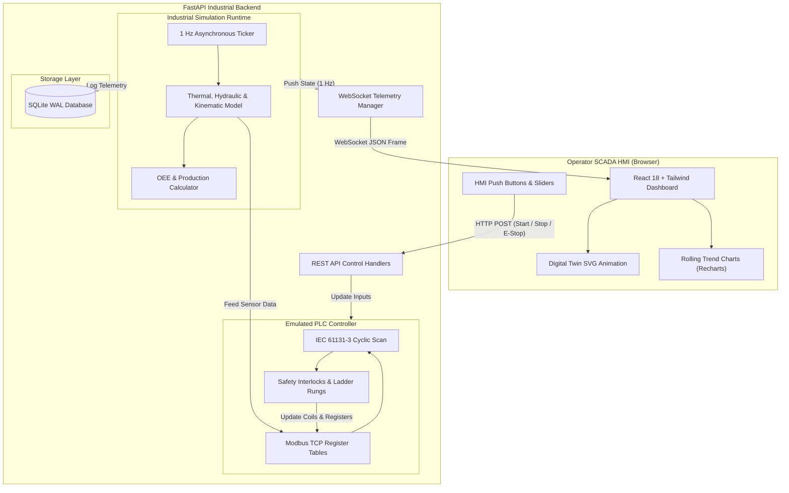

# PLC-SCADA Digital Twin System Architecture

## 1. System Overview

The **PLC-SCADA Digital Twin** is an industrial automation platform simulating a real-world manufacturing and packaging cell. It bridges operational technology (OT) concepts—such as Programmable Logic Controllers (PLC), ladder logic, Modbus registers, safety interlocks, and OEE metrics—with modern information technology (IT) stacks (FastAPI, WebSockets, React, and SQLite).

The platform operates entirely in software with zero physical hardware requirements, delivering sub-second real-time responsiveness and high-fidelity physics.

---

## 2. High-Level Data Flow

---

## 3. Core Architectural Layers

### A. Presentation Layer (SCADA HMI)
- **Framework**: React 18, Vite, Tailwind CSS.
- **Visuals**: High-contrast industrial dark palette (`#080c14`), scanlines, glowing status LED indicators.
- **Dynamic Digital Twin**: Interactive vector animation of raw material feed, motorized conveyor rollers, traverse workpieces, active machining head, coolant mist spray, rotating fan blades, and photoelectric laser beam.
- **Real-Time Visualizations**: Recharts rendering a 60-second rolling window of Temperature, Pressure, and Motor RPM with safety threshold reference lines.
- **Resilience**: Client automatically detects server disconnection, displaying `"SCADA SERVER DISCONNECTED"` and executing exponential backoff reconnection.

### B. Communication & API Layer
- **Protocol**: HTTP/1.1 REST + WebSocket (RFC 6455).
- **Telemetry Frequency**: 1.0 Hz automatic push frames.
- **Initial Connection**: Immediately dispatches the latest machine snapshot upon socket handshaking to eliminate initialization lag.
- **Heartbeat**: 15-second client-side ping/pong to prevent proxy timeouts.

### C. Emulated PLC Logic & Modbus Register Tables
- **Execution Model**: Emulates a cyclic PLC scan cycle (Input Image -> Program Execution -> Output Image).
- **Modbus Tables**:
  - **Coils (`00001` - `00005`)**: Conveyor, Pump, Fan, Beacon, E-Stop latch.
  - **Discrete Inputs (`10001` - `10005`)**: Start PB, Stop PB, E-Stop contact, Optical counter sensor.
  - **Input Registers (`30001` - `30005`)**: Scaled Temperature, Scaled Pressure, Motor RPM, Parts, Machine State.
  - **Holding Registers (`40001` - `40005`)**: Alarm thresholds, Speed setpoints, Reset commands.

### D. Industrial Simulation Physics Engine
- **Motor Speed**: Kinematic ramp-up (`+220 RPM/s`) towards setpoint with micro-jitter (±6 RPM); dynamic emergency braking (`0 RPM` instant).
- **Thermal Dynamics**: First-order thermal model where heat generation is proportional to motor load; cooling fan active dissipation reduces temperature by `-1.35°C/s`.
- **Hydraulic/Pneumatic Dynamics**: Fluid circuit generates 4.8–6.2 bar when pump runs; decays to 1.0 bar atmospheric pressure when stopped.
- **Optical Part Detection**: Simulates physical workpieces passing through a photoelectric gate every ~3.5 seconds at nominal speed.

### E. Storage Layer (SQLite WAL)
- Uses SQLite with Write-Ahead Logging (`PRAGMA journal_mode=WAL;`) and `NORMAL` synchronous mode for high-throughput non-blocking writes during 1 Hz simulation loops.
- Tables: `sensor_history`, `alarms`, `machine_events`, `production`.
