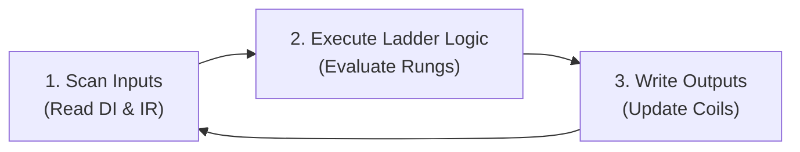

# PLC Control Logic & Safety Interlocks Specification

This document details the industrial control logic implemented in the **PLC-SCADA Digital Twin**, structured according to the **IEC 61131-3** programmable controller execution model.

---

## 1. PLC Scan Cycle

The controller executes in continuous cyclic scans:



1. **Input Scan**: Read physical pushbuttons, E-stop mushroom switch contacts, and scaled sensor readings from Modbus Input Registers.
2. **Logic Execution**: Solve safety interlocks, motor start/stop latching circuits, thermal hysteresis loops, and alarm trip conditions.
3. **Output Scan**: Update actuator coils (Conveyor Motor, Coolant Pump, Cooling Fan, Alarm Horn/Beacon, and E-Stop Flag).

---

## 2. Ladder Logic Rungs Representation

### Rung 1: Master Start / Stop Latch with Safety Interlock
```text
   START_PB        STOP_PB        E_STOP_TRIP     HIGH_PRESSURE     CONVEYOR_RUN
-----] [-----+-------]/[--------------]/[--------------]/[--------------( )------
             |                                                           |
CONVEYOR_RUN |                                                           |
-----] [-----+                                                           |
```
- **Logic**: Pressing `START_PB` energizes `CONVEYOR_RUN` **only** if `E_STOP_TRIP` is normal and no critical `HIGH_PRESSURE` fault exists.
- The state latches until `STOP_PB` is pressed or a safety interlock trips.

---

### Rung 2: Coolant Pump Interlock
```text
  CONVEYOR_RUN     E_STOP_TRIP                                      PUMP_RUN
-------] [--------------]/[-------------------------------------------( )------
```
- Coolant pump runs simultaneously with conveyor to provide continuous tool lubrication during operation.

---

### Rung 3: Thermal Cooling Fan Hysteresis Control
```text
  TEMP > 70.0°C                                                   FAN_LATCH
-------] [-----+------------------------------------------------------(S)------
               |
  TEMP < 60.0°C|                                                  FAN_LATCH
-------] [-----+------------------------------------------------------(R)------

   FAN_LATCH       E_STOP_TRIP                                      COOLING_FAN
-------] [--------------]/[-------------------------------------------( )------
```
- **Hysteresis Band**: When temperature rises above **70.0°C**, cooling fan sets `ON` and warning alarm latches. The fan stays active until temperature cools down below **60.0°C** to prevent relay chatter.
- **Safety Cutoff**: If an Emergency Stop occurs, fan output drops to prevent electrical or mechanical hazards.

---

### Rung 4: High Pressure Critical Trip
```text
 PRESSURE > 8.0 bar                                               ALARM_PRESSURE
-------] [------------------------------------------------------------(S)------
```
- If hydraulic pressure exceeds **8.0 bar**, `ALARM_PRESSURE` immediately latches `ON`, de-energizing the conveyor motor and pump.

---

### Rung 5: Emergency Stop Master Trip
```text
   E_STOP_PB                                                      E_STOP_LATCH
-------] [------------------------------------------------------------(S)------
```
- Depressing the physical Mushroom button immediately sets `E_STOP_LATCH`.
- Drops out Conveyor, Pump, and Cooling Fan instantly.
- Motor speed drops to 0 RPM with zero ramp time.

---

### Rung 6: Alarm Reset Permissive Gating
```text
  RESET_PB      E_STOP_PB       TEMP < 70°C     PRESSURE <= 8 bar   CLEAR_ALARMS
----] [------------]/[--------------] [-----------------] [------------( )------
```
- **Safety Interlock**: The operator cannot reset alarms while a dangerous condition persists. Reset is granted **only** when:
  1. E-Stop mushroom button contact is physically released.
  2. Measured temperature is below 70.0°C.
  3. Measured hydraulic pressure is below 8.0 bar.

---

## 3. Modbus TCP Register Address Map

| Modbus Address | Table | Data Type | Name | Engineering Unit | Description |
| :--- | :--- | :--- | :--- | :--- | :--- |
| **00001** | Coil | BOOL | Conveyor Run | 0=OFF, 1=ON | Master conveyor motor contactor |
| **00002** | Coil | BOOL | Coolant Pump Run | 0=OFF, 1=ON | Coolant circulating pump contactor |
| **00003** | Coil | BOOL | Cooling Fan Run | 0=OFF, 1=ON | Thermal exhaust cooling fan |
| **00004** | Coil | BOOL | Alarm Beacon / Horn | 0=OFF, 1=ON | Strobe light and audible siren |
| **00005** | Coil | BOOL | E-Stop Active Flag | 0=OK, 1=TRIPPED | Safety relay status |
| **10001** | Discrete Input | BOOL | Start Pushbutton | 0=Open, 1=Pressed | Green momentary start input |
| **10002** | Discrete Input | BOOL | Stop Pushbutton | 0=Closed, 1=Pressed | Red momentary stop input |
| **10003** | Discrete Input | BOOL | E-Stop Contact | 0=Normal, 1=Depressed| Hardware safety circuit contact |
| **10004** | Discrete Input | BOOL | Optical Part Sensor | 0=Clear, 1=Detected | Photoelectric laser gate |
| **10005** | Discrete Input | BOOL | Thermal Overload Trip | 0=Normal, 1=Tripped | Motor protection relay contact |
| **30001** | Input Register | INT16 | Measured Temperature| 0.1 °C (e.g. 245 = 24.5°C) | RTD / Thermocouple analog input |
| **30002** | Input Register | INT16 | Measured Pressure | 0.1 bar (e.g. 52 = 5.2 bar) | Pressure transducer analog input |
| **30003** | Input Register | INT16 | Motor Speed | RPM (0–1500) | Optical tachometer pulse encoder |
| **30004** | Input Register | INT16 | Part Counter | Units (0–1000) | Total produced parts count |
| **30005** | Input Register | INT16 | Machine State Code | 0=STOP, 1=RUN, 2=FAULT, 3=ESTOP | SCADA status enumeration |
| **40001** | Holding Register| INT16 | Temp High Limit | 0.1 °C (Default: 700 = 70.0°C) | Over-temperature trip setpoint |
| **40002** | Holding Register| INT16 | Temp Reset Limit | 0.1 °C (Default: 600 = 60.0°C) | Fan deactivation hysteresis point|
| **40003** | Holding Register| INT16 | Pressure High Limit | 0.1 bar (Default: 80 = 8.0 bar) | High pressure trip setpoint |
| **40004** | Holding Register| INT16 | Speed Setpoint | RPM (Default: 1200 RPM) | Inverter target speed reference |
| **40005** | Holding Register| INT16 | Reset Command Word | Hex Command | Software reset register |
